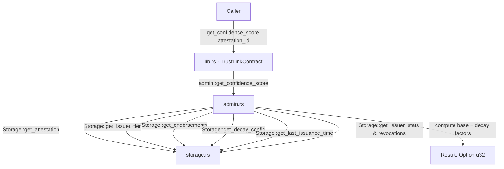

# Design Document: Attestation Confidence Score

## Overview

TrustLink provides a dynamic confidence scoring system (`get_confidence_score`) that evaluates the credibility of an attestation on-demand. Rather than storing a static score on the attestation struct, the score is computed dynamically based on:

1. **Issuer Trust Tier**: Base points determined by the issuer's assigned `IssuerTier` (`Basic`: 30, `Verified`: 60, `Premium`: 90). Unassigned issuers default to `Basic` (30).
2. **Attestation Endorsements**: +2 points per endorsement from authorized endorsers (capped at +10 points).
3. **Inactivity Decay**: A linear time-decay penalty halving the score every `half_life_days` of issuer inactivity.
4. **Revocation Ratio Decay**: A penalty proportional to the issuer's historical revocation rate (`revocations / total_issued`), weighted by `revocation_weight`.

The resulting score is an integer between 0 and 100 (or `None` if the attestation does not exist).

## Architecture



## Components and Interfaces

### lib.rs — TrustLinkContract

```rust
pub fn get_confidence_score(env: Env, attestation_id: String) -> Option<u32> {
    admin::get_confidence_score(&env, attestation_id)
}

pub fn set_decay_config(env: Env, admin: Address, config: DecayConfig) -> Result<(), Error> {
    admin::set_decay_config(&env, admin, config)
}

pub fn get_decay_config(env: Env) -> DecayConfig {
    admin::get_decay_config(&env)
}

pub fn set_issuer_tier(env: Env, admin: Address, issuer: Address, tier: IssuerTier) -> Result<(), Error> {
    admin::set_issuer_tier(&env, admin, issuer, tier)
}

pub fn get_issuer_tier(env: Env, issuer: Address) -> Option<IssuerTier> {
    admin::get_issuer_tier(&env, issuer)
}
```

### admin.rs — Scoring Algorithm

1. **Attestation Lookup**: Retrieve `Attestation` by ID. If not found, return `None`.
2. **Base Score Calculation**:
   - `tier_score`: 90 for `Premium`, 60 for `Verified`, 30 for `Basic` or `None`.
   - `endorsement_score`: `(endorsements.len() * 2).min(10)`.
   - `base_score = (tier_score + endorsement_score) as u64`.
3. **Inactivity Decay**:
   - If `cfg.half_life_days == 0`, `activity_factor_bps = 10_000`.
   - Otherwise, `days_inactive = (now - last_issuance_time) / SECS_PER_DAY`.
   - `penalty = (days_inactive * 5000 / cfg.half_life_days).min(10000)`.
   - `activity_factor_bps = 10_000 - penalty`.
4. **Revocation Ratio Decay**:
   - If `cfg.revocation_weight == 0` or `total_issued == 0`, `reputation_factor_bps = 10_000`.
   - Otherwise, `ratio_bps = (revocations * 10000 / total_issued).min(10000)`.
   - `penalty = (ratio_bps * cfg.revocation_weight / 100).min(10000)`.
   - `reputation_factor_bps = 10_000 - penalty`.
5. **Final Computation**:
   - `decayed = (base_score * activity_factor_bps / 10000) * reputation_factor_bps / 10000`.
   - Return `Some(decayed as u32)`.

## Data Models

### types.rs — IssuerTier

```rust
#[contracttype]
#[derive(Copy, Clone, Debug, Eq, PartialEq)]
pub enum IssuerTier {
    Basic = 0,
    Verified = 1,
    Premium = 2,
}
```

### types.rs — DecayConfig

```rust
#[contracttype]
#[derive(Clone, Debug, Eq, PartialEq)]
pub struct DecayConfig {
    pub half_life_days: u32,
    pub revocation_weight: u32,
}

impl Default for DecayConfig {
    fn default() -> Self {
        Self {
            half_life_days: 90,
            revocation_weight: 50,
        }
    }
}
```

## Correctness Properties

### Property 1: Non-existent attestation returns None
Calling `get_confidence_score` with an unknown `attestation_id` returns `None`.

### Property 2: Issuer tier bounds
- `Basic` / unassigned tier yields a base score of 30 (plus endorsements up to +10).
- `Verified` tier yields a base score of 60 (plus endorsements up to +10).
- `Premium` tier yields a base score of 90 (plus endorsements up to +10).

### Property 3: Inactivity decay monotonicity
For an active issuer with `half_life_days > 0`, increasing the ledger timestamp without new issuance monotonically decreases or maintains the confidence score.

### Property 4: Revocation decay scaling
For an issuer with revocations and `revocation_weight > 0`, a higher revocation count lowers the confidence score relative to the baseline.

## Testing Strategy

- **Tier impact tests**: Verify scores for Basic (30), Verified (60), and Premium (90) tiers.
- **Endorsement bonus tests**: Verify each endorsement adds +2 points, capped at +10.
- **Decay tests**: Verify score reduction when ledger timestamp advances without issuance.
- **Revocation penalty tests**: Verify score reduction when revocations occur under non-zero revocation weight.
- **Admin configuration tests**: Verify admin-only permissions on `set_decay_config` and `set_issuer_tier`.
