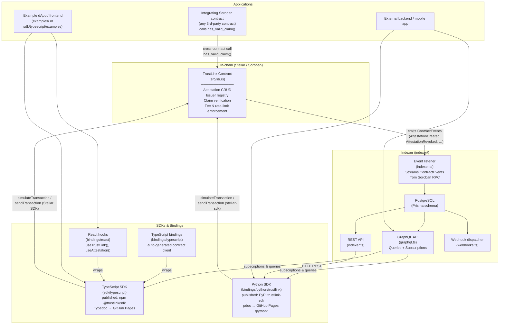

# TrustLink Architecture Overview

This document describes how the major components of TrustLink relate to each other and how data flows through the system.

## Component diagram

## Data flow narrative

1. **Issuers** call `create_attestation` (or batch variants) on the contract through the TypeScript or Python SDK, or directly via the Soroban CLI.
2. The **TrustLink contract** validates the call (auth, fee, rate limits, whitelist), writes the attestation to persistent ledger storage, and emits a `ContractEvent` (e.g. `AttestationCreated`).
3. The **indexer** event listener streams these events from the Soroban RPC endpoint in real time. Each event is decoded and persisted to PostgreSQL via Prisma.
4. The **GraphQL API** exposes the indexed data for efficient queries and real-time subscriptions (WebSocket). The **REST API** provides the same data for simpler HTTP clients. **Webhooks** push notifications to registered endpoints on attestation changes.
5. **SDKs** (TypeScript and Python) provide typed client libraries. They call the contract directly for write operations and can query either the contract (for authoritative reads) or the indexer (for filtered/paginated history).
6. **Integrating contracts** call `has_valid_claim` or `has_valid_claim_from_issuer` via cross-contract invocation — the contract is the single source of truth for claim validity on-chain.
7. **Frontend applications** use the React hooks binding or TypeScript SDK. **Backend applications** use the Python SDK or query the GraphQL/REST API.

## Component responsibilities

| Component | Location | Responsibility |
|-----------|----------|---------------|
| Contract | `src/` | On-chain truth: CRUD, auth, events |
| Indexer event listener | `indexer/src/indexer.ts` | Real-time event ingestion |
| Indexer database | `indexer/prisma/` | Off-chain history and query efficiency |
| GraphQL API | `indexer/src/graphql.ts` | Rich queries + live subscriptions |
| REST API | `indexer/src/index.ts` | Simple HTTP access to indexed data |
| Webhook dispatcher | `indexer/src/webhooks.ts` | Push notifications on attestation events |
| TypeScript SDK | `sdk/typescript/` | Typed contract client + indexer integration |
| Python SDK | `bindings/python/trustlink/` | Python-native contract + indexer client |
| TypeScript bindings | `bindings/typescript/` | Auto-generated low-level contract client |
| React hooks | `bindings/react/` | React-specific hooks for dApps |

## Key design decisions

- **Contract is authoritative.** The indexer is an eventually-consistent read replica. For claim verification in another smart contract, always use the cross-contract call (`has_valid_claim`), never an off-chain index.
- **Events drive the indexer.** The contract emits a `ContractEvent` for every state change. The indexer derives all its state from these events — there is no direct database write path that bypasses event emission.
- **SDKs are thin wrappers.** Both SDKs wrap the `@stellar/stellar-sdk` (TypeScript) or `stellar-sdk` (Python) primitives directly. There is no proprietary RPC layer.

## Further reading

- [Integration Guide](./integration-guide.md) — how to call the contract from code
- [Troubleshooting & FAQ](./troubleshooting.md) — common integration errors
- [Performance Reference](./performance.md) — compute unit costs per function
- [Storage Layout](./storage-layout.md) — ledger entry structure
- [Indexer GraphQL API](../indexer/GRAPHQL.md) — full GraphQL schema reference
